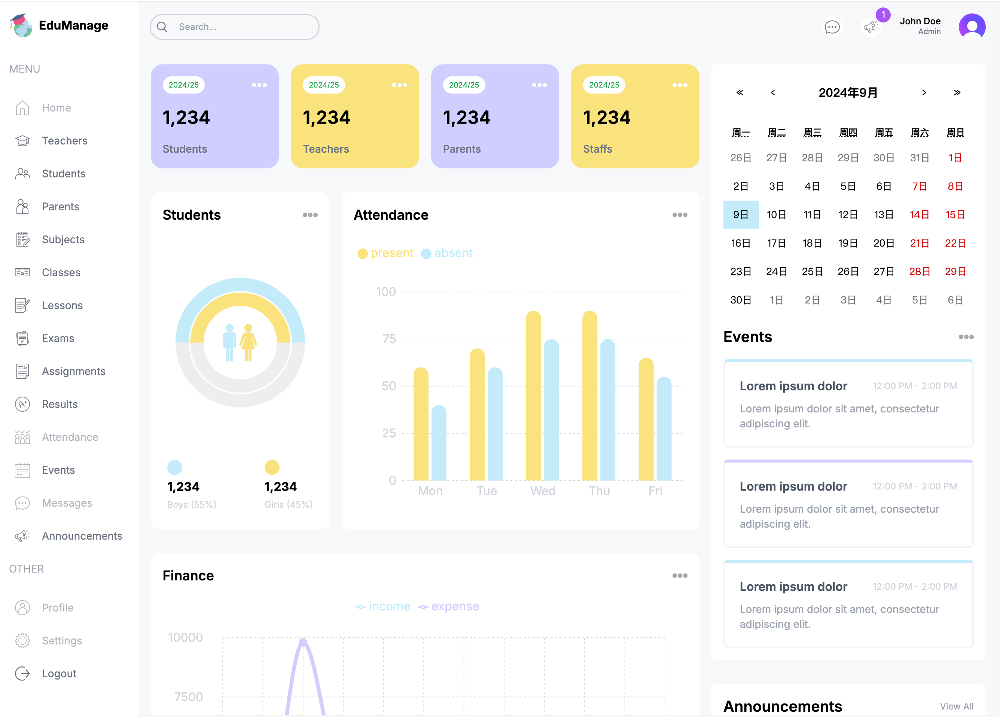
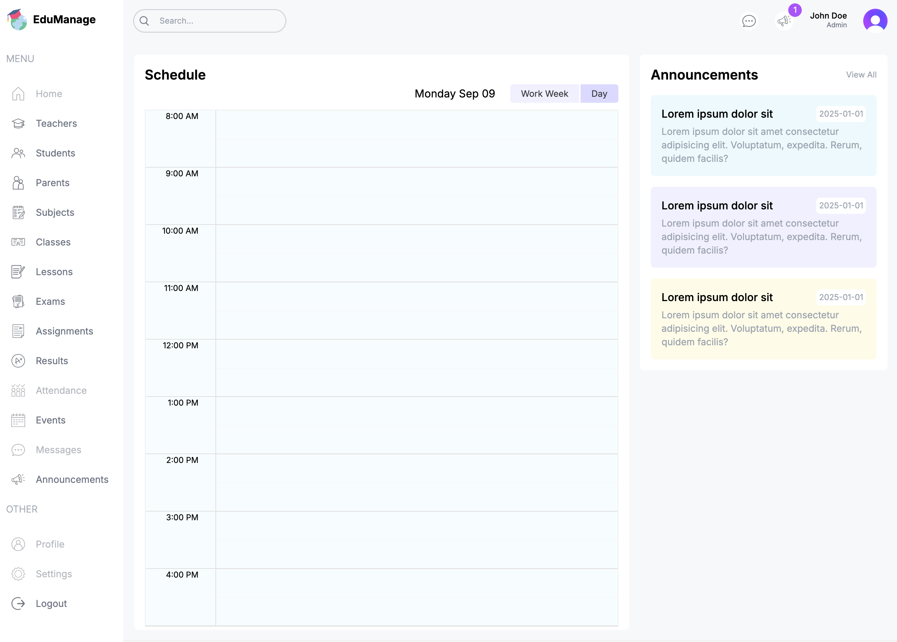
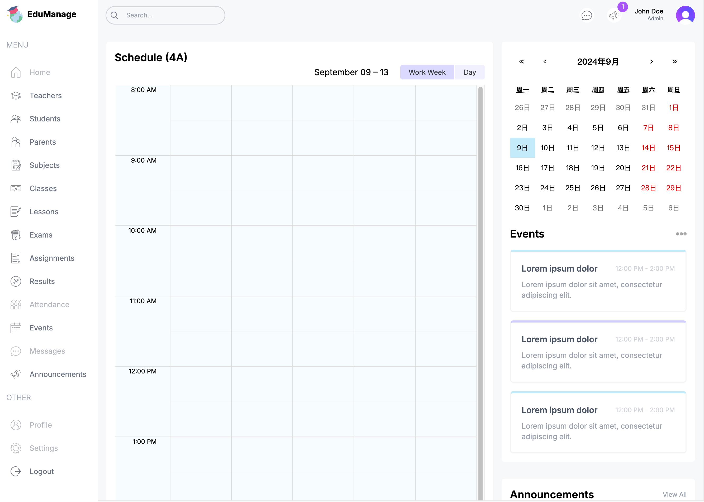

项目介绍
# 项目名称

EduManage Dashboard
## 项目概述
EduManage Dashboard 是一个基于 Next.js 构建的现代化仪表盘应用。该项目旨在提供一个高效、直观的用户界面，用于管理和展示各种数据。项目采用了最新的前端技术栈，确保了高性能和良好的用户体验。

## 项目预览
**管理员视图**

**教师视图**
 

**学生视图**

## 主要功能
### 用户管理
- 创建、更新和删除教师、学生、家长等用户信息。
- 用户信息表单采用动态加载，提升页面加载速度。

### 课程管理
- 管理课程、班级、科目等信息。
- 支持课程的创建、更新和删除操作。

### 考试管理
- 管理考试信息，包括考试安排、成绩录入等。
- 提供考试结果的统计和分析功能。

### 作业管理
- 管理学生作业，包括作业布置、提交和批改。
- 支持作业的创建、更新和删除操作。

### 考勤管理
- 管理学生考勤记录，支持考勤数据的录入和查询。
- 提供考勤统计和分析功能。

### 事件和公告
- 发布和管理学校事件和公告。
- 支持事件和公告的创建、更新和删除操作。

## 技术栈
- 前端框架: Next.js - 一个基于 React 的服务端渲染框架，提供了出色的开发体验和性能优化。
- 状态管理: 使用 React 的 useState 和 useReducer 钩子进行状态管理。
- 表单处理: react-hook-form - 一个高性能、灵活的表单处理库。
- 表单验证: zod - 一个类型安全的表单验证库。
- UI 组件: 使用 Tailwind CSS 进行快速样式开发。
- 动态加载: 使用 Next.js 的 dynamic 进行组件的动态加载，提升页面加载速度。
- 图表展示: recharts - 一个基于 React 的图表库，用于展示数据统计结果。
- 日期处理: moment - 一个强大的日期处理库。

## 技术亮点
- 服务端渲染 (SSR): 通过 Next.js 提供的服务端渲染功能，提升了页面的加载速度和 SEO 性能。
- 动态加载组件: 使用 Next.js 的 dynamic 函数进行组件的动态加载，减少了初始加载时间。
- 高性能表单处理: 采用 react-hook-form 进行表单处理，结合 zod 进行表单验证，确保了表单的高性能和类型安全。
- 响应式设计: 使用 Tailwind CSS 进行响应式设计，确保了在不同设备上的良好用户体验。
- 数据可视化: 通过 recharts 提供丰富的数据可视化功能，帮助用户更直观地理解数据。

## 运行项目
- 开发环境
- 生产环境

## 目录结构

## 结语
EduManage Dashboard 是一个功能丰富、技术先进的仪表盘应用，适用于各种数据管理和展示需求。通过采用现代化的前端技术栈，项目不仅具备高性能和良好的用户体验，还具备良好的可扩展性和维护性。
